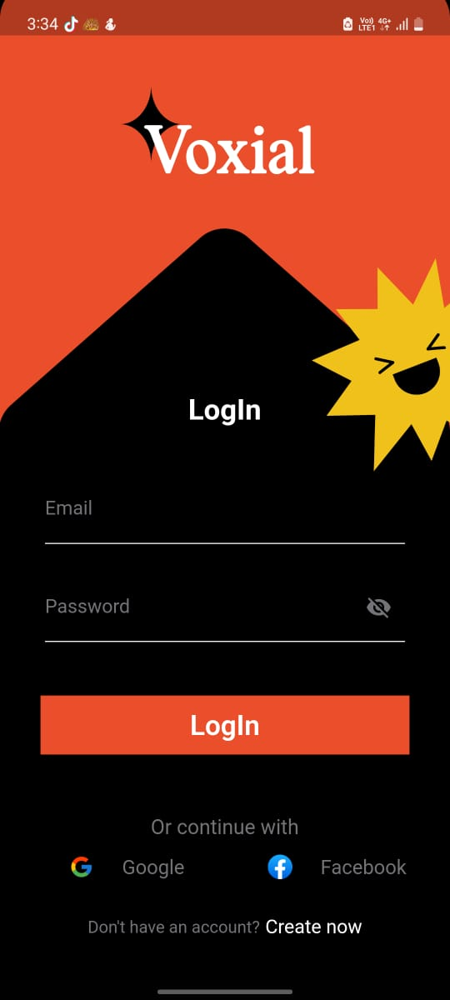
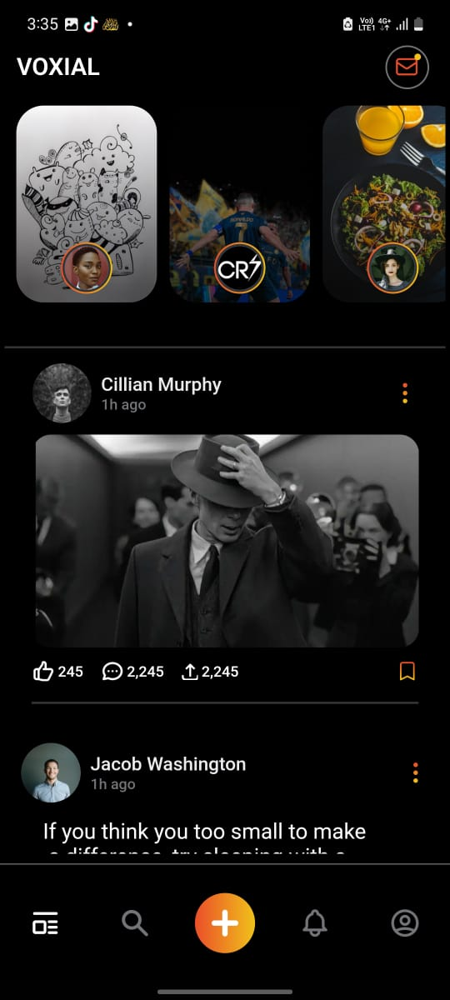
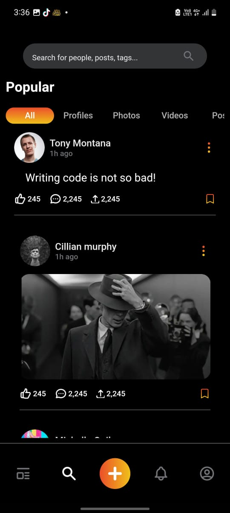
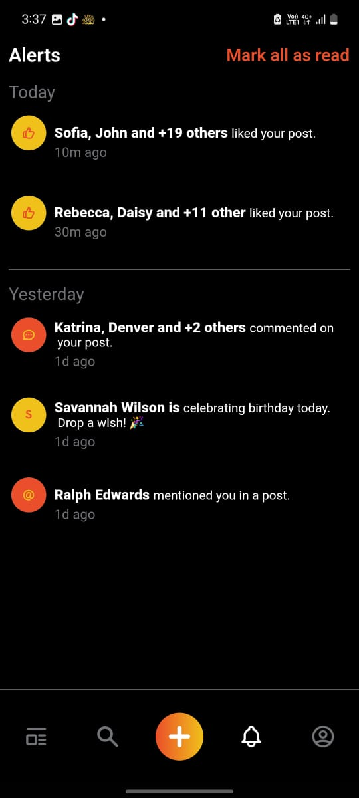
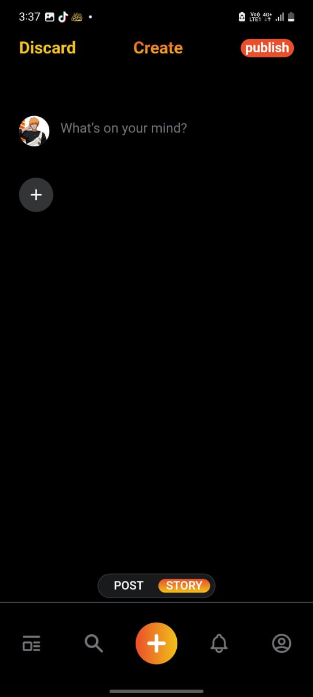
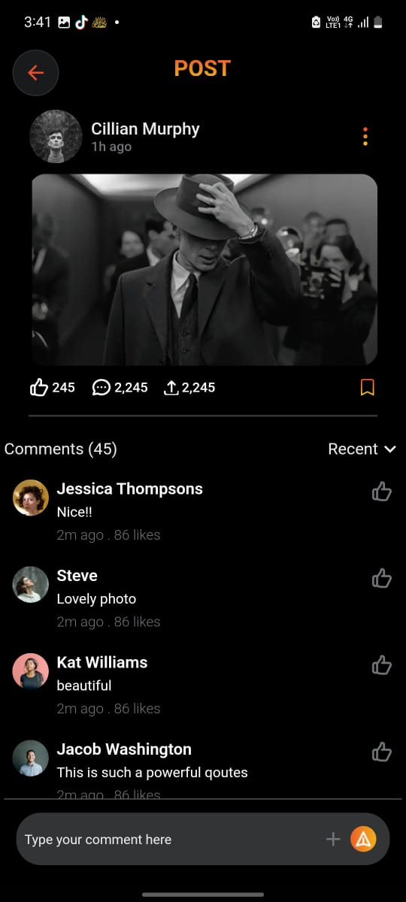
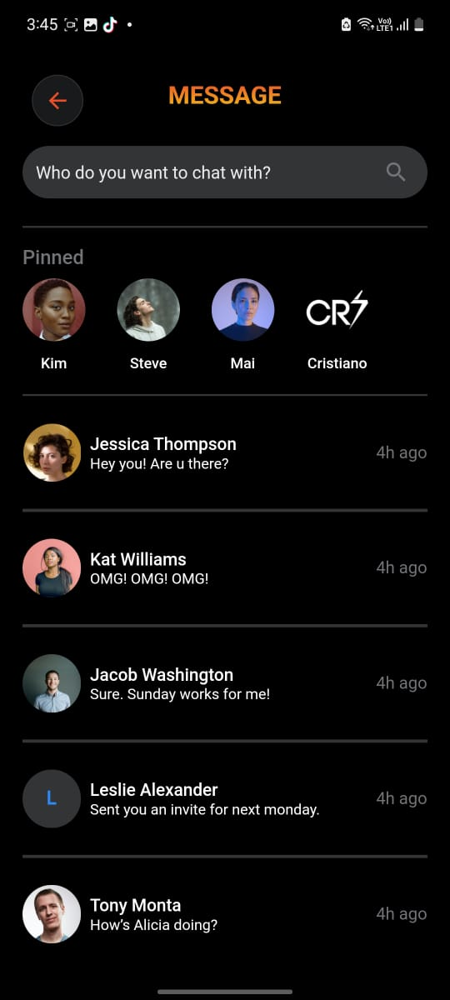
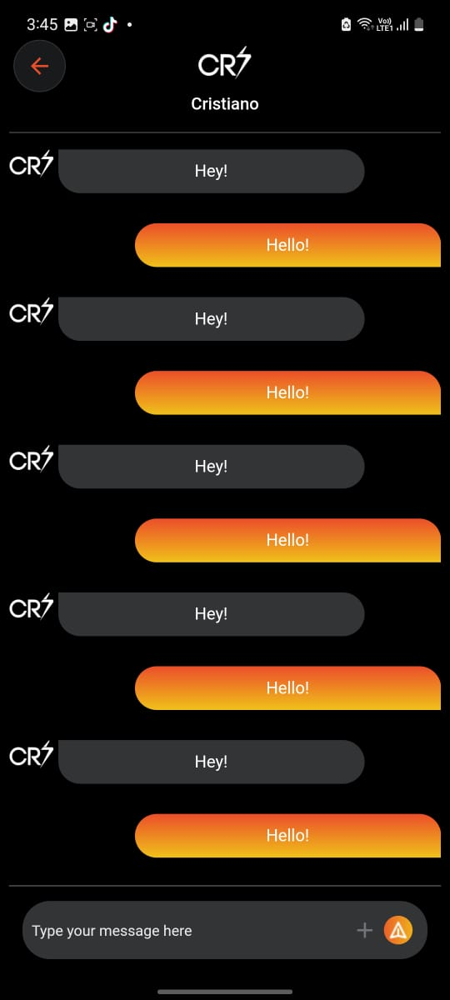

# voxiall

A Flutter project that was an assignment i was required to do at my college. You can tell that it looks like instagram app, it includes a number of screens and all data is static , no backend or dynamic data

## App ScreenShots

Here are some screenshots for the application:

### 📽️ Demo Video

[▶️ Watch the video](https://drive.google.com/file/d/1dJe2GeB_75557axh-BE5MTdO5pP8yDDd/view?usp=sharing)
